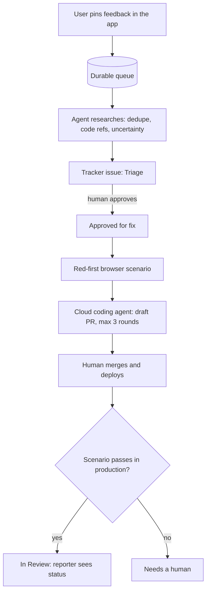

# User-driven development

**User feedback becomes a pull request — with a human gate and production verification.**

A user points at a problem inside your running application and writes a comment. An agent researches it and files an issue. You approve it. A coding agent writes a failing scenario, fixes the code and opens a draft PR. After you merge and deploy, the scenario is re-run in production, and the user sees that their report shipped.

This repository describes that loop, the principles it needs, and what happened over fourteen weeks of building and running it in a real system. It is meant for a small team with its own application and a known group of users who send feedback — testers, internal staff, early customers.

> The name is used elsewhere for "involving users in design". Here it means something narrower: the user's report is the input that starts a code change.

## Why this exists

I'm not a software engineer by training — I ran businesses and sales teams. Today I build, on my own and with coding agents, the ERP of a company of about 200 people. Its users report problems by pointing at them on the screen, and this loop is how those reports turn into fixes.

It did not work well at first. In July, about 30% of the fixes I sent for review came back for rework. In September it was about 6%. What changed in between are the rules in [concept.md](docs/concept.md) — almost every one of them was added after something broke, and the [case study](docs/case-study.md) shows what.

This repository is **not** my production setup copied as is. I generalized it into a template with a small demo app, so expect rough edges. If you try it in your own app, I'd like to hear what broke and what you changed — [issues and pull requests are welcome](CONTRIBUTING.md). It may be most useful if, like me, you are not a full-time programmer but run real software with coding agents.

## The loop



## Two levels

| | Basic | Full |
|---|---|---|
| Feedback goes to | GitHub Issues | A queue table in your database |
| Coding agent starts from | GitHub Actions | A dispatcher on your own server, polling Linear |
| Coding agent | Claude Code (GitHub Action) | Codex Cloud |
| Red-first scenario, rework rounds, production verification | No | Yes |
| You need | A GitHub repository and a model API key | A server, a Linear account, a ChatGPT plan with Codex Cloud |
| Status | Ready, off by default — [how to turn it on](docs/basic-level.md) | Reference implementation, tested against fakes — [how to run it](docs/full-level.md) |

The basic level is meant to be set up from a fork. The full level is the loop from the [case study](docs/case-study.md); it needs infrastructure of your own.

## Run the demo

You need Docker.

```bash
git clone https://github.com/AgasiArgent/user-driven-development.git
cd user-driven-development
docker compose up --build
```

Open http://localhost:3100 — **Roomly**, a small meeting-room booking app with four [seeded bugs](docs/demo-bugs.md). Press **Feedback** in the bottom-right corner, click the element the problem is about, describe it and send. The report gets an ID like `FB-1` and appears under **My feedback** with the status `received`. It is stored in the `feedback_outbox` table, together with a screenshot and the page context.

To deliver reports onward to GitHub Issues and a coding agent, see the [basic level](docs/basic-level.md).

> The demo intake has no authentication and no rate limit. That is fine on localhost and wrong in production.

## Add the widget to your app

```html
<script src="/widget.js" data-endpoint="/api/feedback" data-user="alice" defer></script>
```

- `widget.js` is one file with no framework (about 290 KB, most of it the screenshot library). Build it with `npm ci && npm run build:widget`; it lands in `widget/dist/widget.js`.
- `data-endpoint` is where reports are sent. Your backend accepts the body described in [`contracts/feedback-report.schema.json`](contracts/feedback-report.schema.json) and answers `201 {"id": "...", "status": "received"}`. The demo's implementation is [`demo/lib/feedback.ts`](demo/lib/feedback.ts).
- `data-user` is optional and is passed through as-is.
- Each report carries the comment, the pinned element (CSS selector, tag, text, position), a screenshot, and the page context: URL, window size, browser, the last 20 console errors and the last 20 failed requests (method, URL without query string, status — no bodies).
- Add `data-feedback-mask` to anything that shows personal data: it is painted black on the screenshot. Password fields are always masked.

## Repository layout

| Path | What it is |
|---|---|
| `widget/` | The feedback widget: TypeScript, no framework, built to one file |
| `contracts/` | JSON Schema of a feedback report, shared by the widget and any backend |
| `demo/` | Roomly: Next.js + Postgres demo app, the feedback intake, unit and end-to-end tests |
| `delivery/` | Basic level: moves reports from the queue into GitHub Issues and mirrors their status back |
| `.github/workflows/udd-fix.yml` | Basic level: approved issue → coding agent → no-fly check → draft PR |
| `full/` | Full level: research, intake into Linear, dispatcher for Codex Cloud, production verification, liveness |
| `.udd/`, `scripts/` | No-fly paths and keywords, research ignore list, and the check that enforces no-fly paths |
| `docs/` | Concept, case study, threat model, seeded bugs, basic and full level |

## What it costs

Every report starts paid model runs: research on every report, and coding plus checks on every approved issue. Two things keep this bounded: nothing is coded before a human approves it, and each issue gets at most three rework rounds. Check current prices on the providers' pages: [Anthropic](https://www.anthropic.com/pricing), [OpenAI API](https://openai.com/api/pricing/), [ChatGPT plans](https://chatgpt.com/pricing).

## The numbers

In the system described in the case study, 121 of 479 dispatched issues were marked shipped during weeks 4–14 of the automated loop — about one in four, mostly before production verification and red-first scenarios were added. Of the fixes sent to testers for review, the share returned for rework within 30 days fell from about 30% in July to 13% in August and 6% in September. The [case study](docs/case-study.md) shows where the rest went and what broke along the way.

## Documents

- [The loop and its principles](docs/concept.md) — twelve rules, most of them tied to a failure that made them necessary.
- [Case study](docs/case-study.md) — four generations in one real system, with numbers.
- [Threat model](docs/threat-model.md) — feedback is untrusted input to an agent.

## Roadmap

0. Concept, principles, case study — **done**.
1. A demo application with a feedback widget (pin, comment, screenshot) — **done**.
2. The basic level on GitHub Issues and Actions — **done** (off by default).
3. The full level: queue, research, Linear, Codex Cloud, red-first scenarios, production verification — **done** (reference, not yet run against live services).

## License

[MIT](LICENSE)
