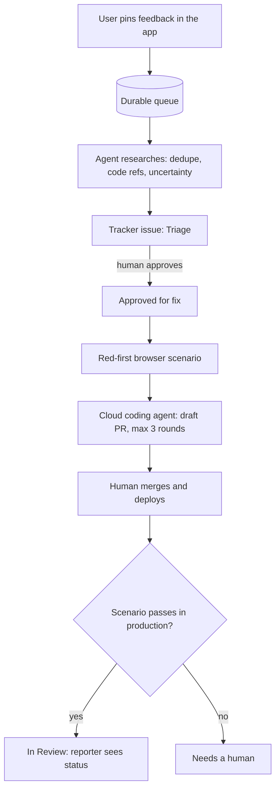

# User-driven development

**User feedback becomes a pull request — with a human gate and production verification.**

A user points at a problem inside your running application and writes a comment. An agent researches it and files an issue. You approve it. A coding agent writes a failing scenario, fixes the code and opens a draft PR. After you merge and deploy, the scenario is re-run in production, and the user sees that their report shipped.

This repository describes that loop, the principles it needs, and what happened when it ran in a real system for fourteen weeks. It is meant for a small team with its own application and a known group of users who send feedback — testers, internal staff, early customers.

> The name is used elsewhere for "involving users in design". Here it means something narrower: the user's report is the input that starts a code change.

## The loop

## Two levels

| | Basic | Full |
|---|---|---|
| Feedback goes to | GitHub Issues | A queue table in your database |
| Coding agent starts from | GitHub Actions | A dispatcher on your own server, polling Linear |
| Coding agent | Claude Code or Codex in Actions | Codex Cloud |
| Red-first scenario, rework rounds, production verification | No | Yes |
| You need | A GitHub repository and a model API key | A server, a Linear account, a ChatGPT plan with Codex Cloud |
| Status | Planned | Planned |

The basic level can be set up from a fork. The full level is the loop from the [case study](docs/case-study.md); it needs infrastructure of your own.

## What it costs

Every report starts paid model runs: research on every report, and coding plus checks on every approved issue. Two things keep this bounded: nothing is coded before a human approves it, and each issue gets at most three rework rounds. Check current prices on the providers' pages: [Anthropic](https://www.anthropic.com/pricing), [OpenAI API](https://openai.com/api/pricing/), [ChatGPT plans](https://chatgpt.com/pricing).

## The numbers

In the system described in the case study, 121 of 479 dispatched issues reached production over eleven weeks of the automated loop — about one in four. The [case study](docs/case-study.md) shows where the rest went and what broke along the way.

## Documents

- [The loop and its principles](docs/concept.md) — twelve rules, each tied to a failure that made it necessary.
- [Case study](docs/case-study.md) — four generations in one real system, with numbers.
- [Threat model](docs/threat-model.md) — feedback is untrusted input to an agent.

## Roadmap

0. Concept, principles, case study — **this release**.
1. A demo application with a feedback widget (pin, comment, screenshot).
2. The basic level on GitHub Issues and Actions.
3. The full level: queue, research, Linear, Codex Cloud, red-first scenarios, production verification.

## License

[MIT](LICENSE)
